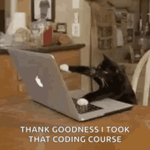

# Hey, I'm Caio
## 👨🏻‍💻 &nbsp;About Me

🎓 &nbsp;I'm currently studying Computer Science at FIAP.\
🌱 &nbsp;I'm learning about Arduino and Raspberry PI.\
✍️ &nbsp;In my free time, I pursue 3D Modeling, Game Development and Video Editing as hobbies/side hustles.\

## ⚡ Tech Stack

### 🚀 Languages

![Java](https://img.shields.io/badge/Java-white?style=for-the-badge&logo=data:image/svg%2Bxml;base64,PHN2ZyB4bWxucz0iaHR0cDovL3d3dy53My5vcmcvMjAwMC9zdmciIHZpZXdCb3g9IjAgMCA1MTIgNTEyIj4KPHBhdGggZmlsbD0iI0Y1ODIxOSIgZmlsbC1ydWxlPSJldmVub2RkIiBkPSJNIDM2Ny4wLDEwNS4wIEwgMzI4LjAsMTE4LjAgTCAzMDAuMCwxMzIuMCBMIDI4MC4wLDE0Ni4wIEwgMjYyLjAsMTY2LjAgTCAyNTQuMCwxODYuMCBMIDI1NC4wLDIwNC4wIEwgMjY0LjAsMjI5LjAgTCAyODEuMCwyNTEuMCBMIDI4Ni4wLDI2NC4wIEwgMjg0LjAsMjc5LjAgTCAyNzAuMCwyOTguMCBMIDI4OS4wLDI4Ni4wIEwgMzAxLjAsMjc0LjAgTCAzMTEuMCwyNTQuMCBMIDMwOS4wLDIzNS4wIEwgMjg0LjAsMTk0LjAgTCAyODMuMCwxNzguMCBMIDI4OC4wLDE2Ni4wIEwgMzE3LjAsMTM3LjAgWiBNIDMwNC4wLDAuMCBMIDMwNi4wLDM1LjAgTCAyOTYuMCw2Mi4wIEwgMjczLjAsOTAuMCBMIDIwMC4wLDE1My4wIEwgMTg2LjAsMTc5LjAgTCAxODYuMCwxOTYuMCBMIDE5Ni4wLDIyMC4wIEwgMjIxLjAsMjUxLjAgTCAyNTIuMCwyODAuMCBMIDIxNi4wLDIyMC4wIEwgMjEyLjAsMjA3LjAgTCAyMTIuMCwxODkuMCBMIDIxOS4wLDE3MS4wIEwgMjI5LjAsMTU3LjAgTCAyODUuMCwxMDYuMCBMIDMxMS4wLDY3LjAgTCAzMTYuMCw1MS4wIEwgMzE3LjAsMzEuMCBMIDMxMi4wLDEyLjAgWiIvPgo8cGF0aCBmaWxsPSIjNEU3ODk2IiBmaWxsLXJ1bGU9ImV2ZW5vZGQiIGQ9Ik0gNDQxLjAsNDYzLjAgTCA0MzEuMCw0NzIuMCBMIDQwMC4wLDQ4NS4wIEwgMzE3LjAsNTAwLjAgTCAxOTUuMCw1MDMuMCBMIDEzMi4wLDQ5Ny4wIEwgMTYzLjAsNTA2LjAgTCAyMTcuMCw1MTEuMCBMIDMzNS4wLDUwOC4wIEwgMzgwLjAsNTAxLjAgTCA0MTMuMCw0OTEuMCBMIDQyOS4wLDQ4Mi4wIEwgNDM5LjAsNDcxLjAgWiBNIDYzLjAsNDYzLjAgTCA2Ny4wLDQ2OS4wIEwgNzkuMCw0NzQuMCBMIDE0MS4wLDQ4My4wIEwgMTk5LjAsNDg3LjAgTCAyNzkuMCw0ODYuMCBMIDMzNS4wLDQ4MC4wIEwgMzg1LjAsNDY5LjAgTCA0MTMuMCw0NTYuMCBMIDQxOC4wLDQ1MC4wIEwgNDE4LjAsNDQ1LjAgTCA0MDkuMCw0MzguMCBMIDQxMi4wLDQ0Mi4wIEwgNDExLjAsNDQ4LjAgTCAzOTguMCw0NTcuMCBMIDM0My4wLDQ2OC4wIEwgMjc2LjAsNDczLjAgTCAxOTIuMCw0NzMuMCBMIDEyNS4wLDQ2Ni4wIEwgMTA2LjAsNDYxLjAgTCA5Ni4wLDQ1NS4wIEwgOTYuMCw0NTIuMCBMIDEwNS4wLDQ0NS4wIEwgMTQ1LjAsNDM1LjAgTCAxMjQuMCw0MzMuMCBMIDg1LjAsNDQ0LjAgTCA3Mi4wLDQ1MS4wIFogTSAxNjEuMCw0MTAuMCBMIDE2Mi4wLDQxNy4wIEwgMTc2LjAsNDI3LjAgTCAxOTkuMCw0MzQuMCBMIDIzMS4wLDQzOC4wIEwgMjg4LjAsNDM0LjAgTCAzMzMuMCw0MjAuMCBMIDMwNy4wLDQwNy4wIEwgMjU1LjAsNDE0LjAgTCAxOTEuMCw0MTAuMCBMIDE4MC4wLDQwNC4wIEwgMTg1LjAsMzk2LjAgTCAxNjguMCw0MDIuMCBaIE0gMTQ1LjAsMzU4LjAgTCAxNDkuMCwzNjYuMCBMIDE2MC4wLDM3Mi4wIEwgMjEwLjAsMzgxLjAgTCAyODUuMCwzNzguMCBMIDM0Mi4wLDM2NS4wIEwgMzIyLjAsMzUzLjAgTCAyNTkuMCwzNjIuMCBMIDE4NS4wLDM2MC4wIEwgMTcyLjAsMzU3LjAgTCAxNjYuMCwzNTIuMCBMIDE3Mi4wLDM0MC4wIEwgMTU1LjAsMzQ3LjAgWiBNIDEwNC4wLDMxMC4wIEwgMTE2LjAsMzE4LjAgTCAxNDkuMCwzMjQuMCBMIDIzOS4wLDMyNi4wIEwgMzIwLjAsMzE3LjAgTCAzMzcuMCwzMTMuMCBMIDM2MS4wLDMwMS4wIEwgMjg2LjAsMzExLjAgTCAyMjYuMCwzMTQuMCBMIDE2MS4wLDMxMi4wIEwgMTQ3LjAsMzA5LjAgTCAxNDEuMCwzMDQuMCBMIDE1NC4wLDI5NC4wIEwgMTk0LjAsMjgyLjAgTCAxNzYuMCwyODIuMCBMIDEzMC4wLDI5My4wIEwgMTEwLjAsMzAyLjAgWiBNIDQyNS4wLDI4NC4wIEwgNDA3LjAsMjc3LjAgTCAzODkuMCwyNzcuMCBMIDM3OC4wLDI4MC4wIEwgMzcxLjAsMjg2LjAgTCAzODIuMCwyODMuMCBMIDQwMi4wLDI4Ni4wIEwgNDE2LjAsMjk5LjAgTCA0MjAuMCwzMTQuMCBMIDQxOC4wLDMyNC4wIEwgNDA2LjAsMzQzLjAgTCAzNjAuMCwzNzcuMCBMIDQwNC4wLDM2MS4wIEwgNDMyLjAsMzM4LjAgTCA0MzguMCwzMjguMCBMIDQ0MS4wLDMxMS4wIEwgNDM3LjAsMjk3LjAgWiIvPgo8L3N2Zz4=)

### 🧑🏻‍💻 Tools & Platform

### 💻 Workspace

## 📈 &nbsp;GitHub Stats

